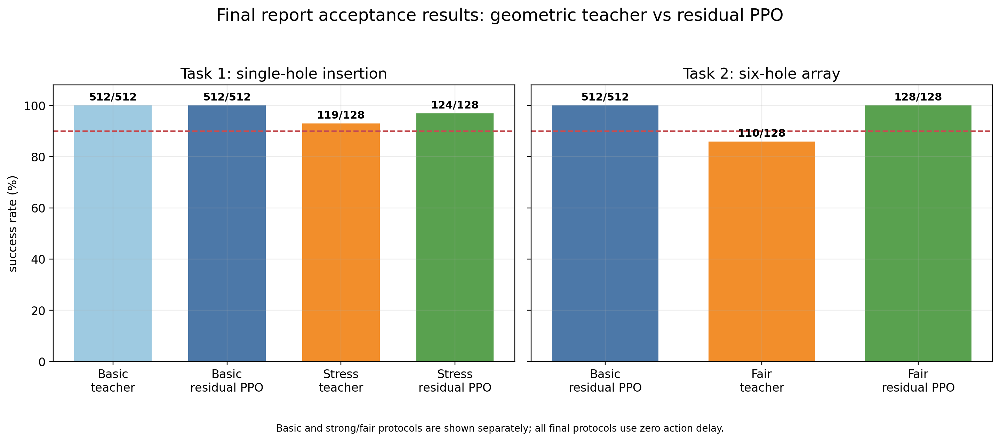
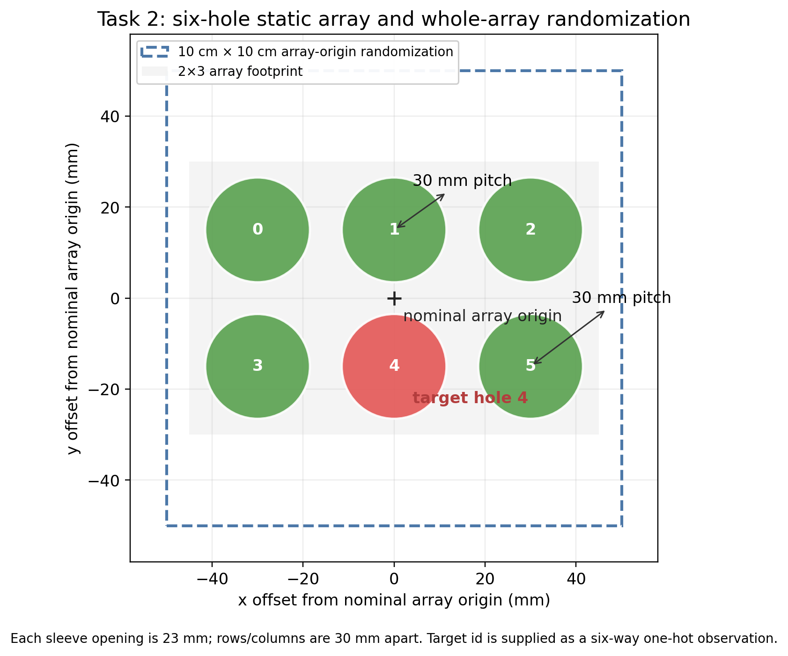
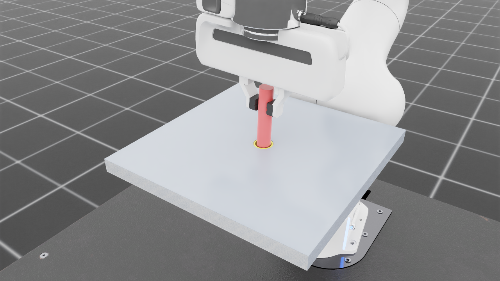
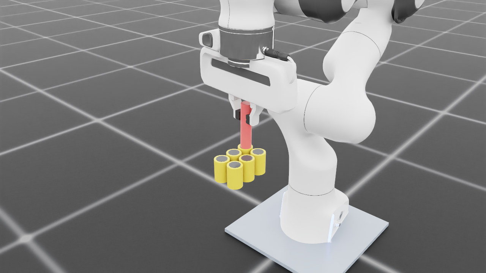

# Franka Peg-in-Hole with Geometric Guidance and Residual PPO

[](https://developer.nvidia.com/isaac-sim)
[](https://isaac-sim.github.io/IsaacLab/)
[](https://www.python.org/)
[](LICENSE)

A simulation study of high-precision peg insertion with a Franka robot in NVIDIA Isaac Sim / Isaac Lab. The controller combines an analytical geometric teacher with a bounded PPO residual to improve robustness under pose-estimation and actuation disturbances.

> [!IMPORTANT]
> This repository reports simulation results only. The current robot asset is based on the Isaac Lab Franka Panda model and is not a validated physical FR3 deployment.



## Overview

The project contains two tasks:

- **Task 1 - Random single-hole insertion:** a 20 mm peg is inserted into a 23 mm hole whose position is randomized over an approximately 10 cm x 10 cm workspace.
- **Task 2 - Targeted six-hole insertion:** the robot inserts into a commanded hole in a fixed 2 x 3 array while the entire array is randomized over the workspace.

The policy does not receive a noise-free absolute peg or hole pose. Its action is

```text
final action = frozen geometric-teacher action + bounded PPO residual
```

The teacher provides a stable approach-align-insert motion, while PPO learns local corrections for fixed hole-position bias, action noise, and control-gain variation.

<p align="center">
  
</p>

## Results

An episode is successful only when all of the following are satisfied within 20 seconds: radial error <= 1.3 mm, insertion depth between 15 and 40 mm, peg tilt <= 2 degrees, and no workspace violation.

| Task and evaluation protocol | Geometric teacher | Residual PPO | PPO gain |
|---|---:|---:|---:|
| Task 1, nominal | 512/512 (100%) | 512/512 (100%) | 0.00 pp |
| Task 1, strong disturbance | 119/128 (92.97%) | 124/128 (96.88%) | +3.91 pp |
| Task 2, nominal six-hole | - | 512/512 (100%) | - |
| Task 2, fair strong disturbance | 110/128 (85.94%) | 128/128 (100%) | +14.06 pp |

For the 128 successful Task 2 episodes under the final disturbance protocol:

| Metric | Mean | Minimum | Maximum |
|---|---:|---:|---:|
| Insertion depth | 16.461 mm | 15.012 mm | 26.465 mm |
| Radial error | 0.836 mm | 0.084 mm | 1.294 mm |
| Peg tilt | 0.736 deg | 0.153 deg | 1.612 deg |

<table>
  <tr>
    <td align="center"><strong>Task 1: single-hole insertion</strong></td>
    <td align="center"><strong>Task 2: targeted six-hole insertion</strong></td>
  </tr>
  <tr>
    <td></td>
    <td></td>
  </tr>
</table>

Detailed evidence is available in the [Task 1 disturbance summary](runs/eval/stress_rl_gain_hole05_bias_500_summary.md), [Task 2 teacher evaluation](runs/eval/task2_fair_teacher_action0305_gate2_128.json), and [Task 2 PPO evaluation](runs/eval/task2_fair_ppo_task1ppo_action02_eval128.json).

## Method

The control stack has three components:

1. **Geometric teacher** - computes bounded 6D relative-pose commands from peg-to-hole displacement, insertion depth, tilt, and orientation error.
2. **Residual PPO** - a `64-64-Tanh` network predicts a correction scaled by `0.15`; a residual penalty keeps the learned policy close to the teacher.
3. **Operational Space Control** - converts 6D pose commands into robot motion at 30 Hz while physics runs at 120 Hz.

Task 1 uses a 30-dimensional observation. Task 2 adds a 6-dimensional one-hot target-hole encoding, producing a 36-dimensional observation.

The final disturbance protocol includes a 0.5 mm episode-fixed hole-position bias, per-step action noise, and 5% episode-level action-gain variation. No action delay is used.

## Requirements

The experiments were developed and verified with:

| Component | Version |
|---|---|
| Ubuntu | 22.04.5 LTS |
| Python | 3.10.20 |
| NVIDIA Isaac Sim | 4.5.0 |
| Isaac Lab | 2.1.0 |
| PyTorch | 2.5.1 |
| RSL-RL | 2.3.3 |

A Linux system with an NVIDIA GPU and a working Isaac Sim / Isaac Lab installation is required. The reported 1024-environment training runs used an RTX 5880 Ada with 49 GB VRAM; smaller GPUs can use fewer parallel environments.

## Quick Start

Clone the repository and activate an Isaac Lab 2.1 environment:

```bash
git clone https://github.com/<your-username>/Franka_FR3_Peg_in_Hole.git
cd Franka_FR3_Peg_in_Hole
conda activate isaac_lab
export OMNI_KIT_ACCEPT_EULA=YES
```

For GUI runs, the supplied helper configures the local Omniverse library paths. Edit it first if your Conda or Omniverse installation uses a different location.

```bash
source scripts/setup_env.sh
```

Run a small environment check:

```bash
python scripts/verify_env.py \
  --task Isaac-PegInHole-Franka-OSC-Pose6D-Hole23mm-v0 \
  --num_envs 4 --steps 10
```

Run a short training smoke test:

```bash
python scripts/train_phase1.py \
  --task Isaac-PegInHole-Franka-OSC-Pose6D-Hole23mm-v0 \
  --geometric_teacher_residual \
  --residual_penalty_coef 100 \
  --smoke
```

Evaluate the final Task 1 checkpoint:

```bash
python scripts/eval_checkpoint_simple.py \
  --checkpoint runs/ppo/stress/custom/20260818_164739/model_499.pt \
  --task Isaac-PegInHole-Franka-OSC-Pose6D-Hole23mm-v0 \
  --episodes 128 --num_envs 64 --seed 42 \
  --episode_length_s 20 --nullspace_stiffness 20 \
  --geometric_teacher_residual --teacher_alignment_gate_mm 1 \
  --hole_xy_bias_std_mm 0.5 \
  --action_noise_std 0.02 --action_gain_noise_std_pct 5 \
  --reset_warmup_steps 20
```

Use `--help` on the training and evaluation scripts for all options. Exact final protocols are recorded in the run configurations and evaluation files under [`runs/`](runs/).

## Repository Layout

```text
assets/                       Franka asset with the fixed peg assembly
tasks/franka_peg_in_hole/     task definitions, observations, rewards, and termination logic
scripts/                      training, evaluation, visualization, and plotting tools
runs/ppo/                     selected final checkpoints and run configurations
runs/eval/                    archived evaluation results
artifacts/                    report figures, screenshots, and replay trajectories
```

The four retained checkpoints are:

| Purpose | Checkpoint |
|---|---|
| Task 1 nominal PPO | `runs/ppo/hole20_reward/20260818_130108/model_49.pt` |
| Task 1 disturbance-robust PPO | `runs/ppo/stress/custom/20260818_164739/model_499.pt` |
| Task 2 nominal PPO | `runs/ppo/custom/20260818_141826/model_49.pt` |
| Task 2 disturbance-robust PPO | `runs/ppo/custom/20260818_232714/model_499.pt` |


## Limitations

- The results are simulation-only and do not establish real-robot success rates.
- The current asset references the Isaac Lab Franka Panda model rather than an official FR3 model.
- Real deployment requires robot-model calibration, force and safety interfaces, collision limits, emergency-stop integration, and staged sim-to-real validation.

## License

The project software is released under the [MIT License](LICENSE). NVIDIA Isaac Sim, Isaac Lab, PyTorch, RSL-RL, and other third-party components remain subject to their own licenses and terms.
